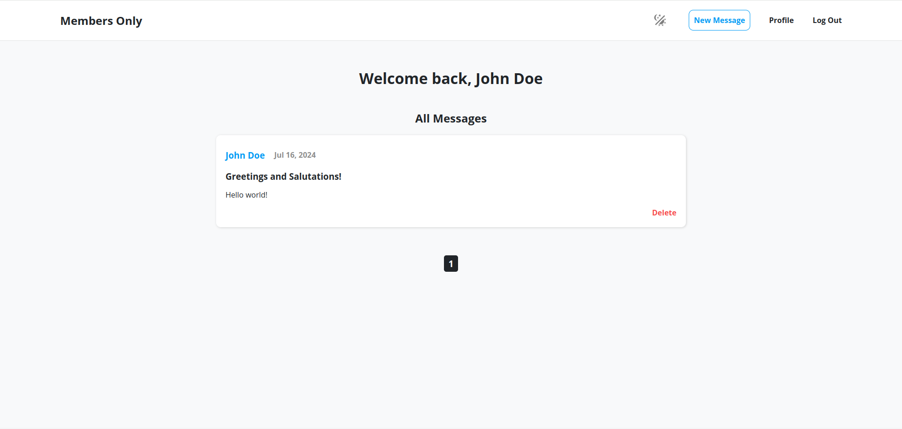

# Members-Only

## Overview

Password to become a member (Default): **Members_Only012345**

Members Only for [The Odin Project](https://www.theodinproject.com/lessons/nodejs-members-only)

## Preview



## The Process

### Built With

- Pug
- Node (Express)
- SQL
- PassportJS
- JavaScript
- CSS

### Features

- User authentication
- Profile management
- Role-based access
- Message creation
- User searching
- Light/Dark theme

### Running Locally

To run the application locally:

1. Clone the repository:

   ```bash
   git clone git@github.com:Purpleboxe/Members-Only.git
   ```

2. Enter the project directory:

   ```bash
   cd Members-Only
   ```

3. Install dependencies:

   ```bash
   npm install
   ```

4. Set up environment variables:
   Create a `.env` file in the root of the directory and add the following:

   ```env
   DATABASE_URL=your_postgresql_database
   MEMBER_PASSWORD=your_member_password
   ```

5. Start the application:

   ```bash
   npm start
   ```

6. Open up your web browser and go to `http://localhost:3000/`.

## Conclusion

This web application allows users to sign up, log in, create messages, and more. Users can have different roles with the default including non-member, member, and admin. This project was one that I enjoyed making; however, I initially struggled with user authentication as I didn't have any prior knowledge on the topic. Learning how users can have different permissions depending on their role was also very useful and something to keep in mind because of its common use in modern web apps. Anyhow, have fun messaging!
